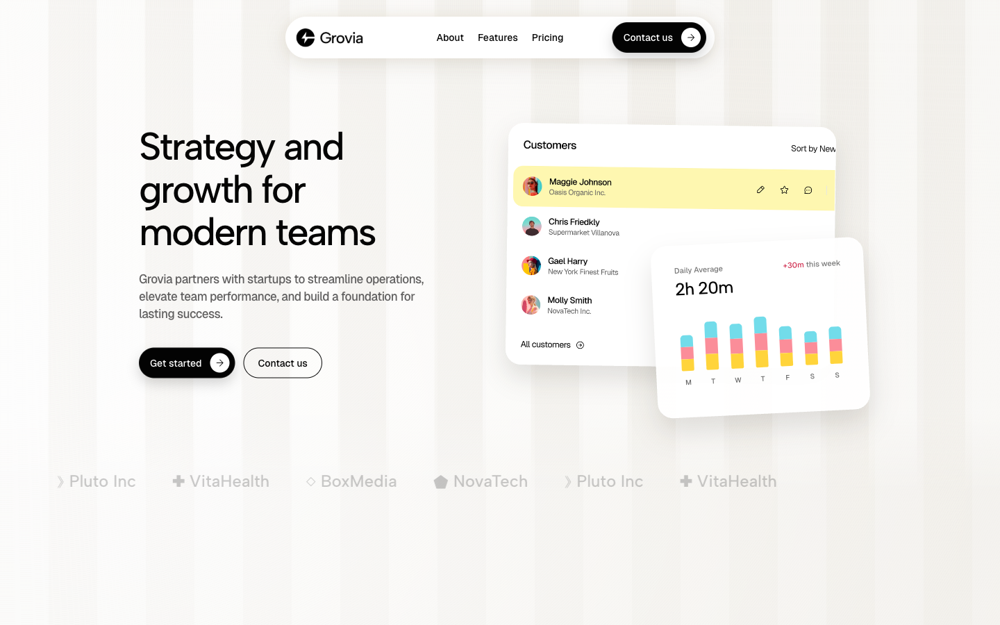
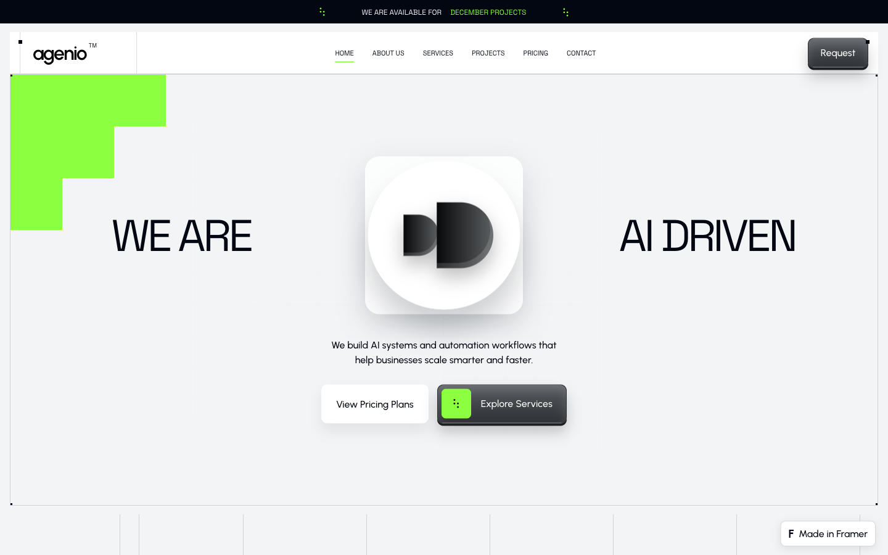
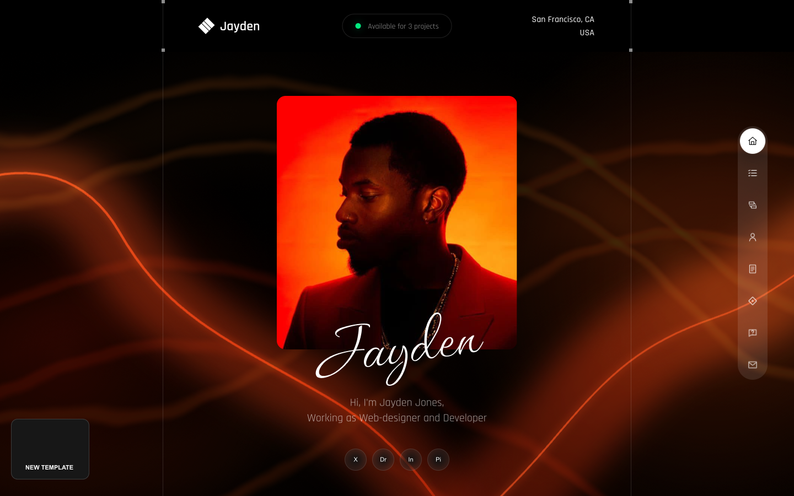

# Framer landing pages in Next.js

A single Next.js App Router project containing six isolated landing-page
families. Each design keeps its own route namespace, components, assets, and
responsive behavior.

## Landing pages

| **Slate** · `/` | **Grovia** · `/grovia` |
| --- | --- |
|  |  |
| **Fuel** · `/fuel` | **Agenio** · `/agenio` |
|  |  |
| **Jayden** · `/jayden` | **Saazai** · `/saazai` |
|  |  |

The screenshots above were captured from the production build at 1440×900.

## Route map

| Site | Route family | Included pages |
| --- | --- | --- |
| Slate | `/` | Main marketing page |
| Grovia | `/grovia` | Main strategy and growth page |
| Fuel | `/fuel/*` | Home, about, contact, work, portfolio index and details, blog index and articles, custom 404 |
| Agenio | `/agenio/*` | Home, about, services, contact, projects index and details, blog, custom 404 |
| Jayden | `/jayden/*` | Home, work index and details, services, about, contact, custom 404 |
| Saazai | `/saazai/*` | Home, features, pricing, integration, changelog, about, contact, career, privacy, blog index and articles, custom 404 |

Dynamic portfolio, project, and article routes are backed by local data. The
root-level `/404` route provides the shared fallback page.

## Run locally

```bash
npm install
npm run dev
```

Open [http://localhost:3000](http://localhost:3000).

## Production build

```bash
npm run check
npm run build
npm start
```

The implementation uses local assets, native React interactions, and responsive
CSS.
