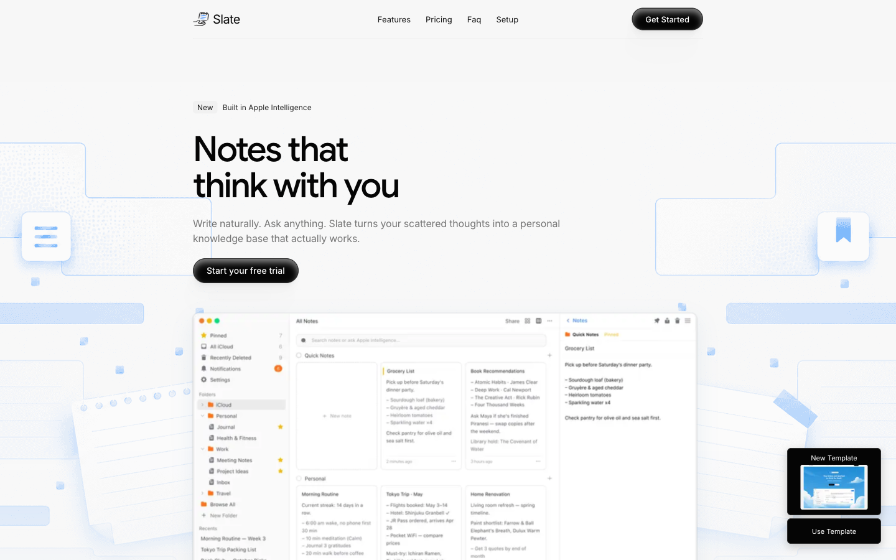
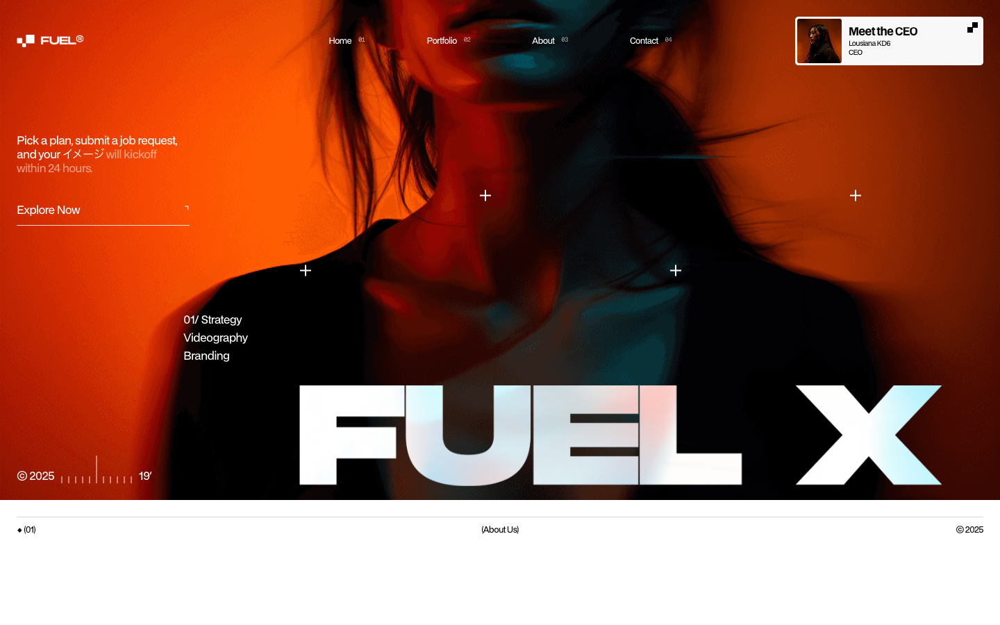
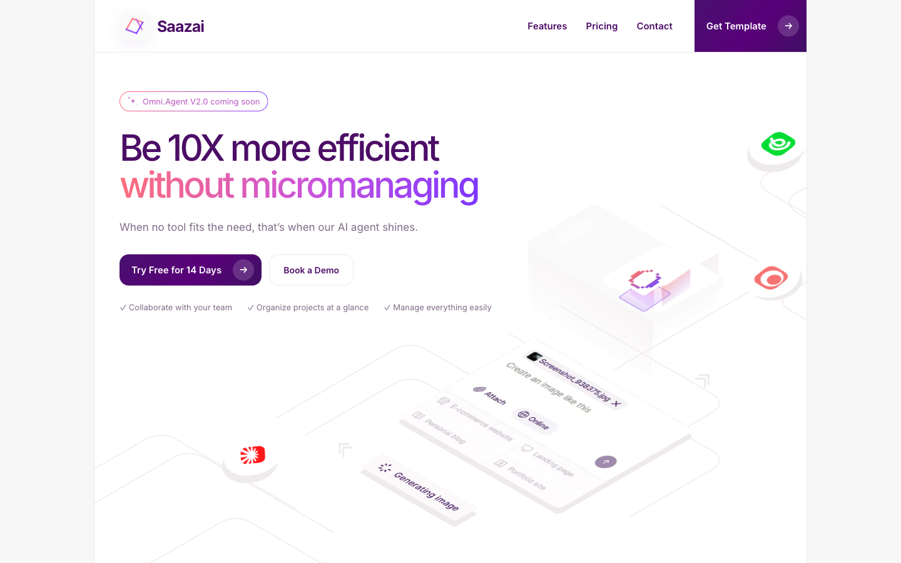
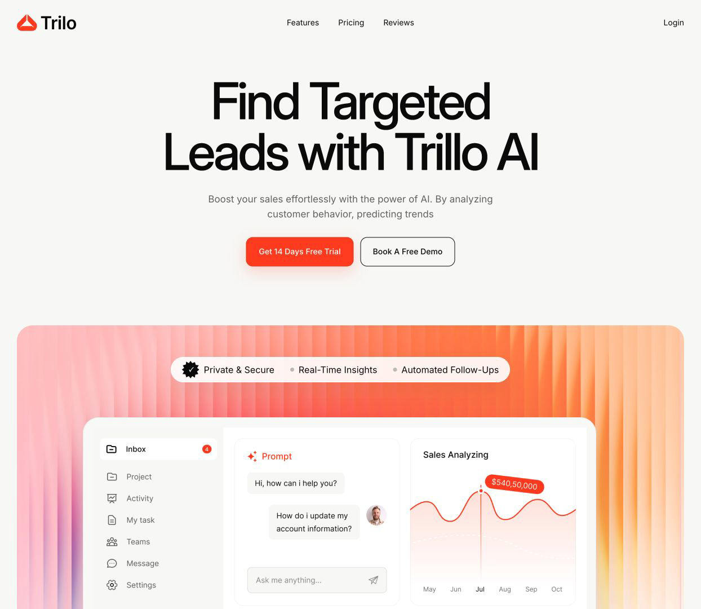
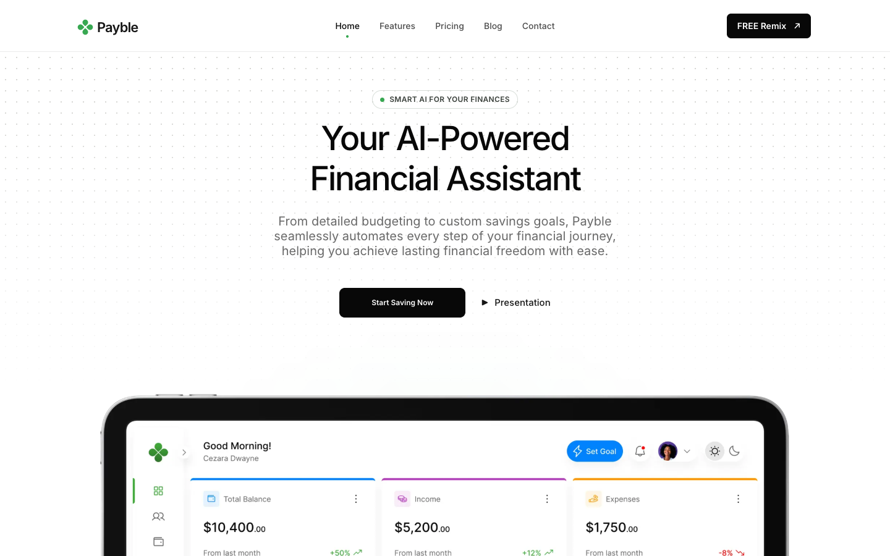
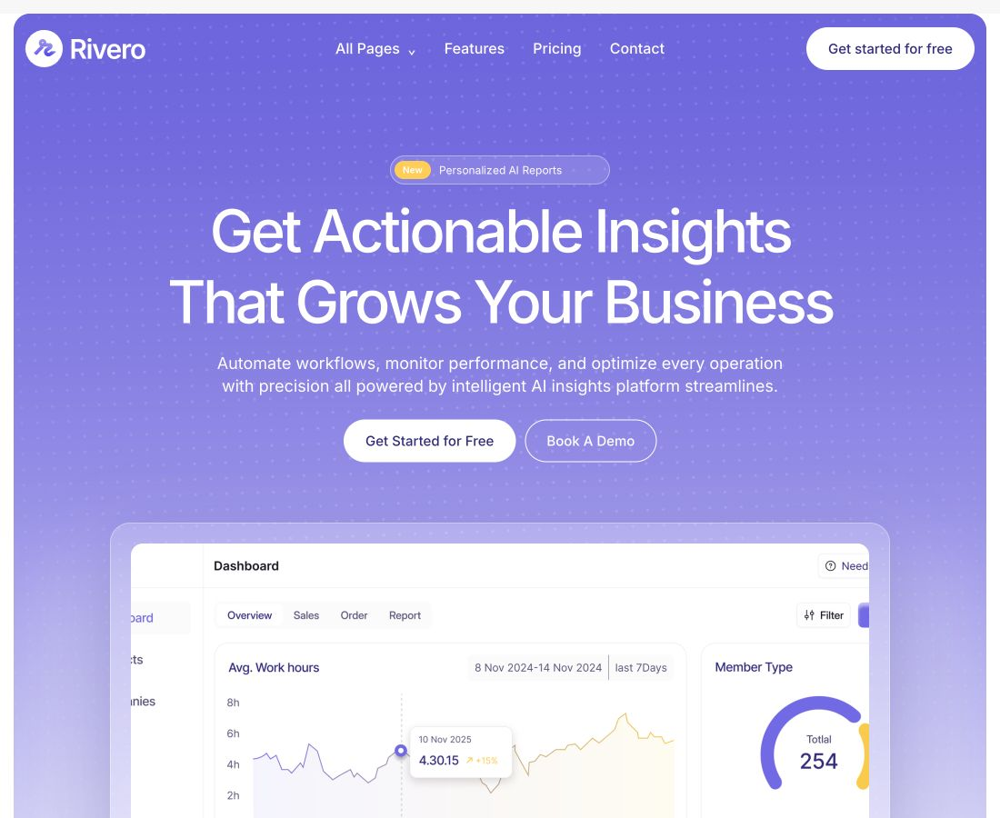
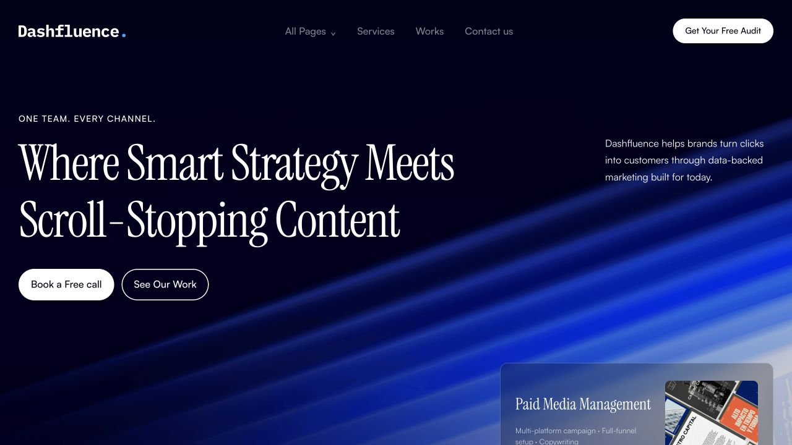

# Framer templates Turborepo

Eleven standalone Next.js template applications and a lightweight showcase live
in one npm-workspaces Turborepo. Each template owns its routes, components,
assets, metadata, validation contract, and deployment boundary.

## Browse the workspace

[Open the Showcase catalog](http://localhost:3000/) ·
[View its full-page capture](output/playwright/landing-pages/showcase-full.png)

<a href="http://localhost:3000/">
  
</a>

## Template showcase

Each preview opens the template at its standalone local URL. Expand
**Routes** below any design to open every valid page declared in that
workspace's `template.config.json`.

### Slate

`@framer-templates/slate` ·
[http://localhost:3001/](http://localhost:3001/) · port `3001`

<a href="http://localhost:3001/">
  
</a>

<details>
<summary><strong>Routes (1)</strong></summary>

- [`/`](http://localhost:3001/)

</details>

### Grovia

`@framer-templates/grovia` ·
[http://localhost:3002/](http://localhost:3002/) · port `3002`

<a href="http://localhost:3002/">
  
</a>

<details>
<summary><strong>Routes (1)</strong></summary>

- [`/`](http://localhost:3002/)

</details>

### Fuel

`@framer-templates/fuel` ·
[http://localhost:3003/](http://localhost:3003/) · port `3003`

<a href="http://localhost:3003/">
  
</a>

<details>
<summary><strong>Routes (14)</strong></summary>

- [`/`](http://localhost:3003/)
- [`/about`](http://localhost:3003/about)
- [`/contact`](http://localhost:3003/contact)
- [`/work`](http://localhost:3003/work)
- [`/work/portfolio`](http://localhost:3003/work/portfolio)
- [`/work/portfolio/vellfire-calibration`](http://localhost:3003/work/portfolio/vellfire-calibration)
- [`/work/portfolio/dunwill-lanson`](http://localhost:3003/work/portfolio/dunwill-lanson)
- [`/work/portfolio/noara-willis`](http://localhost:3003/work/portfolio/noara-willis)
- [`/work/portfolio/nike-studios`](http://localhost:3003/work/portfolio/nike-studios)
- [`/blog`](http://localhost:3003/blog)
- [`/blog/velocity-becomes`](http://localhost:3003/blog/velocity-becomes)
- [`/blog/way-to-clearance`](http://localhost:3003/blog/way-to-clearance)
- [`/blog/all-grapples`](http://localhost:3003/blog/all-grapples)
- [`/blog/flowers-love`](http://localhost:3003/blog/flowers-love)

</details>

### Agenio

`@framer-templates/agenio` ·
[http://localhost:3004/](http://localhost:3004/) · port `3004`

<a href="http://localhost:3004/">
  
</a>

<details>
<summary><strong>Routes (9)</strong></summary>

- [`/`](http://localhost:3004/)
- [`/about-us`](http://localhost:3004/about-us)
- [`/services`](http://localhost:3004/services)
- [`/projects`](http://localhost:3004/projects)
- [`/projects/ai-chatbot-website`](http://localhost:3004/projects/ai-chatbot-website)
- [`/projects/nova-ai-assistant`](http://localhost:3004/projects/nova-ai-assistant)
- [`/projects/ai-brand-identity`](http://localhost:3004/projects/ai-brand-identity)
- [`/blog`](http://localhost:3004/blog)
- [`/contact`](http://localhost:3004/contact)

</details>

### Jayden

`@framer-templates/jayden` ·
[http://localhost:3005/](http://localhost:3005/) · port `3005`

<a href="http://localhost:3005/">
  
</a>

<details>
<summary><strong>Routes (8)</strong></summary>

- [`/`](http://localhost:3005/)
- [`/about`](http://localhost:3005/about)
- [`/service`](http://localhost:3005/service)
- [`/work`](http://localhost:3005/work)
- [`/work/x---direct-mobile`](http://localhost:3005/work/x---direct-mobile)
- [`/work/helve-website-redesign`](http://localhost:3005/work/helve-website-redesign)
- [`/work/ui-ux-agency`](http://localhost:3005/work/ui-ux-agency)
- [`/contact`](http://localhost:3005/contact)

</details>

### Saazai

`@framer-templates/saazai` ·
[http://localhost:3006/](http://localhost:3006/) · port `3006`

<a href="http://localhost:3006/">
  
</a>

<details>
<summary><strong>Routes (19)</strong></summary>

- [`/`](http://localhost:3006/)
- [`/about`](http://localhost:3006/about)
- [`/blog`](http://localhost:3006/blog)
- [`/career`](http://localhost:3006/career)
- [`/changelog`](http://localhost:3006/changelog)
- [`/contact`](http://localhost:3006/contact)
- [`/features`](http://localhost:3006/features)
- [`/integration`](http://localhost:3006/integration)
- [`/pricing`](http://localhost:3006/pricing)
- [`/privacy`](http://localhost:3006/privacy)
- [`/blog/what-is-a-no-code-ready-website-design`](http://localhost:3006/blog/what-is-a-no-code-ready-website-design)
- [`/blog/what-is-the-difference-and-when-to-use-them`](http://localhost:3006/blog/what-is-the-difference-and-when-to-use-them)
- [`/blog/how-to-build-a-community-around-your-brand`](http://localhost:3006/blog/how-to-build-a-community-around-your-brand)
- [`/blog/tips-to-boost-your-ai-agents-route-accuracy`](http://localhost:3006/blog/tips-to-boost-your-ai-agents-route-accuracy)
- [`/blog/top-benefits-of-using-digital-dispatch-software`](http://localhost:3006/blog/top-benefits-of-using-digital-dispatch-software)
- [`/blog/smart-ways-to-supercharge-your-ai-agent`](http://localhost:3006/blog/smart-ways-to-supercharge-your-ai-agent)
- [`/blog/empower-your-drivers-with-smarter-mobile-tools`](http://localhost:3006/blog/empower-your-drivers-with-smarter-mobile-tools)
- [`/blog/route-optimization-tactics-that-actually-work-fast`](http://localhost:3006/blog/route-optimization-tactics-that-actually-work-fast)
- [`/blog/what-to-expect-in-trucking-tech-trends`](http://localhost:3006/blog/what-to-expect-in-trucking-tech-trends)

</details>

### Palmer

`@framer-templates/palmer` ·
[http://localhost:3007/](http://localhost:3007/) · port `3007`

<a href="http://localhost:3007/">
  
</a>

<details>
<summary><strong>Routes (13)</strong></summary>

- [`/`](http://localhost:3007/)
- [`/work`](http://localhost:3007/work)
- [`/gallery`](http://localhost:3007/gallery)
- [`/contact`](http://localhost:3007/contact)
- [`/work/sonder-goods`](http://localhost:3007/work/sonder-goods)
- [`/work/halo-wear`](http://localhost:3007/work/halo-wear)
- [`/work/lucent-lab`](http://localhost:3007/work/lucent-lab)
- [`/work/arc-bloom`](http://localhost:3007/work/arc-bloom)
- [`/work/atelier-nara`](http://localhost:3007/work/atelier-nara)
- [`/article/gregory-lalle`](http://localhost:3007/article/gregory-lalle)
- [`/article/clive-willow`](http://localhost:3007/article/clive-willow)
- [`/article/raven-claw`](http://localhost:3007/article/raven-claw)
- [`/article/clay-nicolas`](http://localhost:3007/article/clay-nicolas)

</details>

### Trillo

`@framer-templates/trillo` ·
[http://localhost:3008/](http://localhost:3008/) · port `3008`

<a href="http://localhost:3008/">
  
</a>

<details>
<summary><strong>Routes (1)</strong></summary>

- [`/`](http://localhost:3008/)

</details>

### Payble

`@framer-templates/payble` ·
[http://localhost:3009/](http://localhost:3009/) · port `3009`

<a href="http://localhost:3009/">
  
</a>

<details>
<summary><strong>Routes (21)</strong></summary>

- [`/`](http://localhost:3009/)
- [`/features`](http://localhost:3009/features)
- [`/pricing`](http://localhost:3009/pricing)
- [`/blog`](http://localhost:3009/blog)
- [`/contact`](http://localhost:3009/contact)
- [`/blog/stay-in-control-how-ai-insights-can-prevent-overspending`](http://localhost:3009/blog/stay-in-control-how-ai-insights-can-prevent-overspending)
- [`/blog/how-to-manage-irregular-income-with-ai-powered-financial-tools`](http://localhost:3009/blog/how-to-manage-irregular-income-with-ai-powered-financial-tools)
- [`/blog/how-ai-can-help-you-create-custom-budgets-tailored-to-your-needs`](http://localhost:3009/blog/how-ai-can-help-you-create-custom-budgets-tailored-to-your-needs)
- [`/blog/why-multi-account-sync-is-the-key-to-streamlining-your-finances`](http://localhost:3009/blog/why-multi-account-sync-is-the-key-to-streamlining-your-finances)
- [`/blog/achieve-your-financial-goals-faster-the-role-of-automated-savings-transfers`](http://localhost:3009/blog/achieve-your-financial-goals-faster-the-role-of-automated-savings-transfers)
- [`/blog/real-time-budget-alerts-how-they-keep-your-spending-under-control`](http://localhost:3009/blog/real-time-budget-alerts-how-they-keep-your-spending-under-control)
- [`/blog/the-science-of-financial-forecasting-planning-for-your-financial-future`](http://localhost:3009/blog/the-science-of-financial-forecasting-planning-for-your-financial-future)
- [`/blog/say-goodbye-to-late-fees-the-importance-of-bill-reminders`](http://localhost:3009/blog/say-goodbye-to-late-fees-the-importance-of-bill-reminders)
- [`/blog/master-your-spending-how-spending-habit-analysis-can-transform-your-finances`](http://localhost:3009/blog/master-your-spending-how-spending-habit-analysis-can-transform-your-finances)
- [`/blog/from-small-change-to-big-savings-the-power-of-round-up-savings`](http://localhost:3009/blog/from-small-change-to-big-savings-the-power-of-round-up-savings)
- [`/blog/how-to-build-an-effective-budget-a-step-by-step-guide-for-beginners`](http://localhost:3009/blog/how-to-build-an-effective-budget-a-step-by-step-guide-for-beginners)
- [`/blog/the-power-of-automation-how-ai-driven-tools-simplify-personal-finance`](http://localhost:3009/blog/the-power-of-automation-how-ai-driven-tools-simplify-personal-finance)
- [`/useful/privacy-policy`](http://localhost:3009/useful/privacy-policy)
- [`/useful/cookie-policy`](http://localhost:3009/useful/cookie-policy)
- [`/useful/terms-of-service`](http://localhost:3009/useful/terms-of-service)
- [`/useful/refund-policy`](http://localhost:3009/useful/refund-policy)

</details>

### Pilar

`@framer-templates/pilar` ·
[http://localhost:3010/](http://localhost:3010/) · port `3010`

[Blue](http://localhost:3010/?theme=blue) ·
[Brown](http://localhost:3010/?theme=brown) ·
[Violet](http://localhost:3010/?theme=violet)

<p>
  <a href="http://localhost:3010/?theme=blue"></a>
  <a href="http://localhost:3010/?theme=brown"></a>
  <a href="http://localhost:3010/?theme=violet"></a>
</p>

<details>
<summary><strong>Routes (4)</strong></summary>

- [`/`](http://localhost:3010/)
- [`/contact`](http://localhost:3010/contact)
- [`/privacy`](http://localhost:3010/privacy)
- [`/terms`](http://localhost:3010/terms)

</details>

### Rivero

`@framer-templates/rivero` ·
[http://localhost:3011/](http://localhost:3011/) · port `3011`

<a href="http://localhost:3011/">
  
</a>

<details>
<summary><strong>Routes (45)</strong></summary>

- [`/`](http://localhost:3011/)
- [`/about`](http://localhost:3011/about)
- [`/pricing-v1`](http://localhost:3011/pricing-v1)
- [`/pricing-v2`](http://localhost:3011/pricing-v2)
- [`/feature`](http://localhost:3011/feature)
- [`/reviews`](http://localhost:3011/reviews)
- [`/blog`](http://localhost:3011/blog)
- [`/blog/learn-about-emerging-trends-best-practices-in-hr-payroll-systems-stay-updated`](http://localhost:3011/blog/learn-about-emerging-trends-best-practices-in-hr-payroll-systems-stay-updated)
- [`/blog/discover-the-latest-trends-tips-strategies-in-hr-payroll-management-stay-informed`](http://localhost:3011/blog/discover-the-latest-trends-tips-strategies-in-hr-payroll-management-stay-informed)
- [`/blog/introduce-the-blog-and-encourage-users-to-explore-valuable-hr-insights`](http://localhost:3011/blog/introduce-the-blog-and-encourage-users-to-explore-valuable-hr-insights)
- [`/blog/how-hr-analytics-can-boost-team-performance`](http://localhost:3011/blog/how-hr-analytics-can-boost-team-performance)
- [`/blog/5-effective-ways-to-simplify-payroll-with-automation`](http://localhost:3011/blog/5-effective-ways-to-simplify-payroll-with-automation)
- [`/blog/top-employee-engagement-strategies-for-2025`](http://localhost:3011/blog/top-employee-engagement-strategies-for-2025)
- [`/blog/why-employee-engagement-is-the-key-to-retention`](http://localhost:3011/blog/why-employee-engagement-is-the-key-to-retention)
- [`/blog/how-to-build-a-strong-company-culture-from-day-one`](http://localhost:3011/blog/how-to-build-a-strong-company-culture-from-day-one)
- [`/blog/streamline-your-hiring-process-with-ai-powered-tools`](http://localhost:3011/blog/streamline-your-hiring-process-with-ai-powered-tools)
- [`/blog/why-employee-engagement-drives-employee-retention`](http://localhost:3011/blog/why-employee-engagement-drives-employee-retention)
- [`/blog/how-to-create-a-strong-company-culture-from-the-start`](http://localhost:3011/blog/how-to-create-a-strong-company-culture-from-the-start)
- [`/blog/optimize-your-hiring-process-with-ai-driven-tools`](http://localhost:3011/blog/optimize-your-hiring-process-with-ai-driven-tools)
- [`/case-study`](http://localhost:3011/case-study)
- [`/case-study/how-improved-hr-efficiency-by-60`](http://localhost:3011/case-study/how-improved-hr-efficiency-by-60)
- [`/case-study/optimizing-hr-systems-for-growth`](http://localhost:3011/case-study/optimizing-hr-systems-for-growth)
- [`/case-study/hr-analytics-driving-strategic-decisions`](http://localhost:3011/case-study/hr-analytics-driving-strategic-decisions)
- [`/case-study/improving-compliance-across-hr-departments`](http://localhost:3011/case-study/improving-compliance-across-hr-departments)
- [`/case-study/reducing-errors-in-hr-operations`](http://localhost:3011/case-study/reducing-errors-in-hr-operations)
- [`/case-study/digital-transformation-in-hr-operations`](http://localhost:3011/case-study/digital-transformation-in-hr-operations)
- [`/case-study/what-specific-hr-or-payroll-issues`](http://localhost:3011/case-study/what-specific-hr-or-payroll-issues)
- [`/integrations`](http://localhost:3011/integrations)
- [`/integrations/fusematrix`](http://localhost:3011/integrations/fusematrix)
- [`/integrations/paylink`](http://localhost:3011/integrations/paylink)
- [`/integrations/teamconnect`](http://localhost:3011/integrations/teamconnect)
- [`/integrations/cloudhub`](http://localhost:3011/integrations/cloudhub)
- [`/integrations/shiftmaster`](http://localhost:3011/integrations/shiftmaster)
- [`/integrations/talentflow`](http://localhost:3011/integrations/talentflow)
- [`/integrations/slackmate`](http://localhost:3011/integrations/slackmate)
- [`/integrations/taskboard`](http://localhost:3011/integrations/taskboard)
- [`/integrations/hrbridge`](http://localhost:3011/integrations/hrbridge)
- [`/contact-us`](http://localhost:3011/contact-us)
- [`/appointment`](http://localhost:3011/appointment)
- [`/legal/privacy-policy`](http://localhost:3011/legal/privacy-policy)
- [`/legal/terms-conditions`](http://localhost:3011/legal/terms-conditions)
- [`/changelog/ai-powered-lead-scoring-(3.2.0)-h`](http://localhost:3011/changelog/ai-powered-lead-scoring-(3.2.0)-h)
- [`/changelog/enhanced-analytics-dashboard-(3.1.0)b`](http://localhost:3011/changelog/enhanced-analytics-dashboard-(3.1.0)b)
- [`/changelog/enhanced-analytics-dashboard-(3.0.0)n`](http://localhost:3011/changelog/enhanced-analytics-dashboard-(3.0.0)n)
- [`/changelog/enhanced-analytics-dashboard-(2.5.0)j`](http://localhost:3011/changelog/enhanced-analytics-dashboard-(2.5.0)j)
</details>

### Dashfluence

`@framer-templates/dashfluence` ·
[http://localhost:3018/Dashfluence](http://localhost:3018/Dashfluence) · port `3018`

| Desktop | Mobile |
| --- | --- |
| <a href="http://localhost:3018/Dashfluence"></a> | <a href="http://localhost:3018/Dashfluence"></a> |

<details>
<summary><strong>Routes (35)</strong></summary>

- [`/Dashfluence`](http://localhost:3018/Dashfluence)
- [`/Dashfluence/about`](http://localhost:3018/Dashfluence/about)
- [`/Dashfluence/services`](http://localhost:3018/Dashfluence/services)
- [`/Dashfluence/services/digital-strategy-funnel-mapping`](http://localhost:3018/Dashfluence/services/digital-strategy-funnel-mapping)
- [`/Dashfluence/services/strategy-content-production`](http://localhost:3018/Dashfluence/services/strategy-content-production)
- [`/Dashfluence/services/seo-organic-growth`](http://localhost:3018/Dashfluence/services/seo-organic-growth)
- [`/Dashfluence/services/paid-media-management`](http://localhost:3018/Dashfluence/services/paid-media-management)
- [`/Dashfluence/services/cro-analytics-optimization`](http://localhost:3018/Dashfluence/services/cro-analytics-optimization)
- [`/Dashfluence/work`](http://localhost:3018/Dashfluence/work)
- [`/Dashfluence/work/radiant-skincare-branding`](http://localhost:3018/Dashfluence/work/radiant-skincare-branding)
- [`/Dashfluence/work/illuminate-your-natural-beauty`](http://localhost:3018/Dashfluence/work/illuminate-your-natural-beauty)
- [`/Dashfluence/work/where-radiance-meets-ritual`](http://localhost:3018/Dashfluence/work/where-radiance-meets-ritual)
- [`/Dashfluence/work/brighter-skin-bolder-you`](http://localhost:3018/Dashfluence/work/brighter-skin-bolder-you)
- [`/Dashfluence/work/let-your-skin-light-the-way`](http://localhost:3018/Dashfluence/work/let-your-skin-light-the-way)
- [`/Dashfluence/work/clean-ingredients-visible-glow`](http://localhost:3018/Dashfluence/work/clean-ingredients-visible-glow)
- [`/Dashfluence/work/formulated-for-radiance-backed-by-science`](http://localhost:3018/Dashfluence/work/formulated-for-radiance-backed-by-science)
- [`/Dashfluence/work/start-your-glow-up-from-the-skin-out`](http://localhost:3018/Dashfluence/work/start-your-glow-up-from-the-skin-out)
- [`/Dashfluence/blog`](http://localhost:3018/Dashfluence/blog)
- [`/Dashfluence/blog/seo-in-2025-what-still-works`](http://localhost:3018/Dashfluence/blog/seo-in-2025-what-still-works)
- [`/Dashfluence/blog/how-to-create-scroll-stopping-ads`](http://localhost:3018/Dashfluence/blog/how-to-create-scroll-stopping-ads)
- [`/Dashfluence/blog/mastering-social-media-growth`](http://localhost:3018/Dashfluence/blog/mastering-social-media-growth)
- [`/Dashfluence/blog/the-power-of-data-driven-marketing`](http://localhost:3018/Dashfluence/blog/the-power-of-data-driven-marketing)
- [`/Dashfluence/blog/boosting-brand-awareness-fast`](http://localhost:3018/Dashfluence/blog/boosting-brand-awareness-fast)
- [`/Dashfluence/blog/secrets-to-high-roi-campaigns`](http://localhost:3018/Dashfluence/blog/secrets-to-high-roi-campaigns)
- [`/Dashfluence/blog/growing-with-influencer-marketing`](http://localhost:3018/Dashfluence/blog/growing-with-influencer-marketing)
- [`/Dashfluence/blog/social-media-mistakes-to-avoid`](http://localhost:3018/Dashfluence/blog/social-media-mistakes-to-avoid)
- [`/Dashfluence/blog/storytelling-for-brand-impact`](http://localhost:3018/Dashfluence/blog/storytelling-for-brand-impact)
- [`/Dashfluence/blog/trends-shaping-2025-marketing`](http://localhost:3018/Dashfluence/blog/trends-shaping-2025-marketing)
- [`/Dashfluence/blog/scaling-ads-without-wasting-budget`](http://localhost:3018/Dashfluence/blog/scaling-ads-without-wasting-budget)
- [`/Dashfluence/blog/how-to-improve-engagement-rates`](http://localhost:3018/Dashfluence/blog/how-to-improve-engagement-rates)
- [`/Dashfluence/pricing`](http://localhost:3018/Dashfluence/pricing)
- [`/Dashfluence/reviews`](http://localhost:3018/Dashfluence/reviews)
- [`/Dashfluence/contact-us`](http://localhost:3018/Dashfluence/contact-us)
- [`/Dashfluence/legal/privacy-policy`](http://localhost:3018/Dashfluence/legal/privacy-policy)
- [`/Dashfluence/legal/terms-and-conditions`](http://localhost:3018/Dashfluence/legal/terms-and-conditions)

</details>

Every template serves from `/` when run independently unless their preserved source
namespace is listed above. Existing family-prefixed asset paths remain intact.

## Requirements

- Node.js `22.22.3`
- npm `10.9.8`

The repository includes an `.nvmrc`, so `nvm use` selects the expected Node
version.

## Install and run

Install all workspaces once from the repository root:

```bash
npm ci
```

Run the showcase:

```bash
npm run dev
```

Run every application on its assigned port:

```bash
npm run dev:all
```

Run one template:

```bash
npm run dev --workspace=@framer-templates/fuel
```

Filter Turbo tasks to one application:

```bash
npx turbo run build check --filter=@framer-templates/fuel
```

## Validation

Each application exposes the same interface:

- `dev` and `start`
- `build`
- `typecheck`
- `audit:assets`
- `check`
- `test:routes`

Run the complete acceptance sequence:

```bash
npm run verify
```

`verify` runs checks, builds, and route contracts sequentially so generated
Next.js types are never read while a build is replacing them. Route contracts
live in each application's `template.config.json`. They cover every valid
static and generated route, invalid dynamic slugs, branded 404 pages, titles,
canonical paths, and visible markers.

## Environment

Each template accepts `NEXT_PUBLIC_SITE_URL` for canonical metadata:

```bash
NEXT_PUBLIC_SITE_URL=https://fuel.example.com \
  npm run build --workspace=@framer-templates/fuel
```

The showcase accepts one public URL per template so its cards can point to
independent deployments:

```bash
cp apps/showcase/.env.example apps/showcase/.env.local
```

Set `NEXT_PUBLIC_SLATE_URL`, `NEXT_PUBLIC_GROVIA_URL`, and the remaining
template URL variables in that file. Localhost defaults match the ports in the
workspace map.

## Repository structure

```text
apps/
  showcase/
  slate/
  grovia/
  fuel/
  agenio/
  jayden/
  saazai/
  palmer/
  trillo/
  payble/
  pilar/
  rivero/
  dashfluence/
packages/
  template-validation/
  typescript-config/
```

`packages/template-validation` owns the generic asset and route checks.
Template-specific asset audits remain app-local where the original design
needed additional rules. `packages/typescript-config` supplies the strict
shared Next.js compiler configuration while every app retains its local `@/*`
alias.
